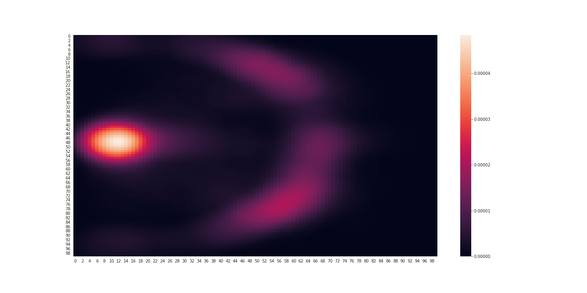
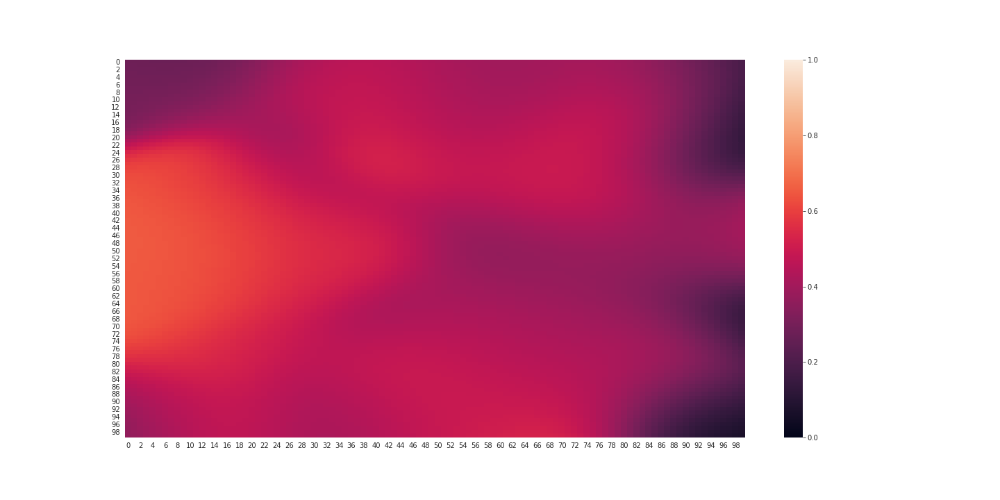
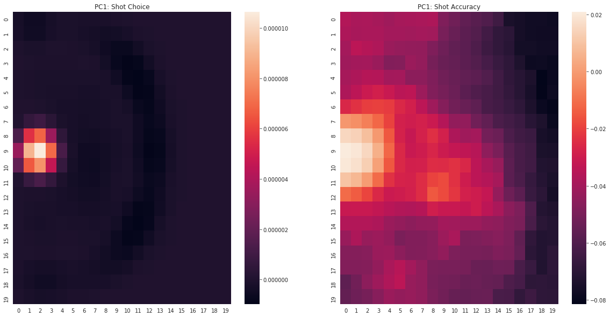
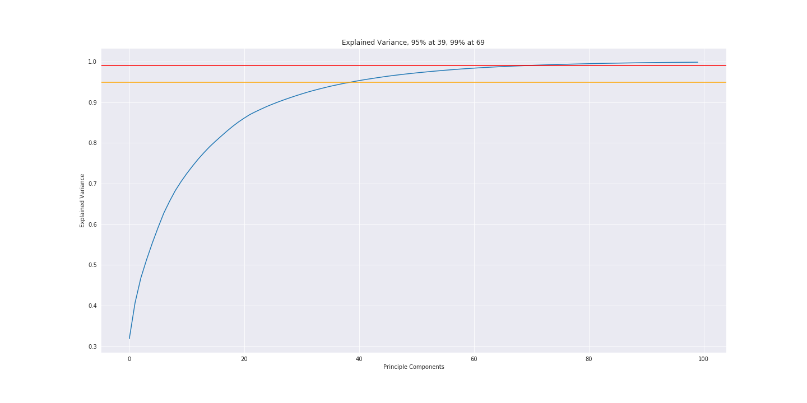
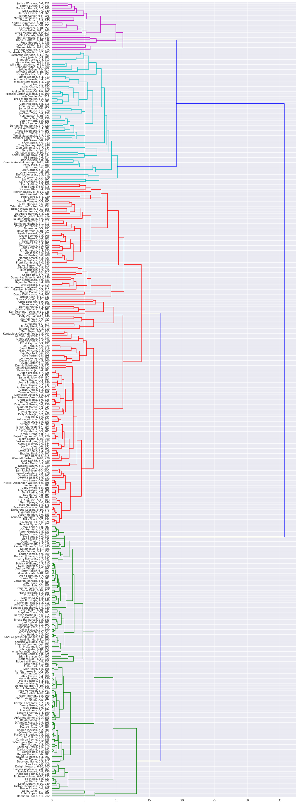

# Shotchart Analysis

This repository was created as part of a project for Georgia Tech ISYE 6740 - Computational Data Analytics.

## The spider

The first part of the repository is contained within the shotchart folder, and is a spider that goes over [Basketball-Reference.com](https://www.basketball-reference.com/)'s game logs, pulling down the x-y location of each shot along with who shot it, when it was taken, and whether or not it was made. The play-by-play table is also pulled, allowing us to determine when a player is on or off the court. Play-by-play data is stored in relatively raw form, while other data is parsed and cleaned in the spider itself. 

## SubCreator.py

After the spider has pulled all the data and stored it, we need to parse the play-by-play data to establish when each player is on court. SubCreator.py does this by reformatting the data, going from the play-by-play format a list of player entrances and exits.

In the play by play format, we can see when a player comes on and who leaves for them. However, we do not have information on when that stint ends. Therefore, we have data that essentially looks like the following (we create the entry/exit stamps at the beginning/end of each quarter):

| Time Remaining | Entering | Exiting Player |
|:---|----|----:|
|12:00|p1||
|12:00|p2||
|12:00|p3||
|6:05|p2|p4|
|0:00||p1|
|0:00||p3|
|0:00||p4|

Once in this format, entrances are matched with corresponding exits to give the following format: 

|Player|Entry Time|Exit Time|
|:---|----|---:|
|p1|12:00|0:00|
|p2|12:00|6:05|
|p3|12:00|0:00|
|p4|6:05|0:00|

From this format, the following python code can easily tell us who is on court at a given time:
```
def get_oncourt(time, quarter, subs):
    if time == 0:
        return subs.query('Exit_Time == 0 & Quarter == @quarter')
    on = subs.query('Entry_Time >= @time & Exit_Time < @time & Quarter == @quarter')
    
    return on.sort_values(['Home', 'Entry_Time'])
```

## Analysis.ipynb

The notebook takes the shot data and, for each player, constructs a shot chart representing their shot choice. On top of this, using Bayes theorem we also estimate player accuracy for given spots on the court. Bayes Theorem is applied as follows: 

$$
P(make|location) = \frac{P(location|make) * P(make)}{P(location)}
$$

Another approach for estimating accuracy would be using a nearest neighbor regression, perhaps with kernel weighting. However, for locations far from any other shots (say because they are bad shots to shoot from), we would be looking at an unrepresentive sample. Therefore, we stick with the Bayes approach instead. 

We have the following charts for Steph Curry, the first showing shot choice and the second accuracy: 



It should be noted that accuracy is estimated using a different bandwidth (ie region of influence) for shots taken by each player. This causes certain issues with being over-zealous about a players chances from farther away from the basket. Using a fixed bandwidth for each player would alleviate this, and save significant amounts of time by eliminating bandwidth tuning. 

Shot charts are distilled into 400 data points each, representing a 20x20 grid over the half-court. Since each player has two charts (shot choice and shot accuracy) this gives us 800 data points per player, a huge number. Therefore, we use PCA to reduce the dimensionality. Principle components are easy to understand, as they can easily be presented in shot chart form. Below is what the first principal component (ie the one that explains the most about the dataset) represents: 



This aligns with the belief that players tend to both shoot a lot from around the basket, and are generally fairly accurate at it. It also shows a slight inverse relationship between shooting at the rim and shooting three-pointers, which is interesting and somewhat expected. Note that the chart is presenting values relative to average, located at 0. 

The principle components are very effective at summarizing the data, as the below graph shows. We can use them to cluster the data without any loss of accuracy. 



Clustering on the first 39 principle components gives us the following dendrogram, showing how similar players are to each other (based on the shot charts we showed). Because all the data is scaled to represent shooting rates, we see some counter-intuitive grouping of low- and high-volume players. 

